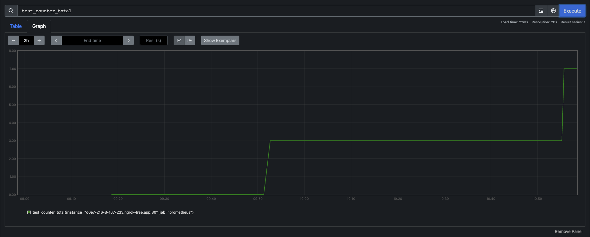
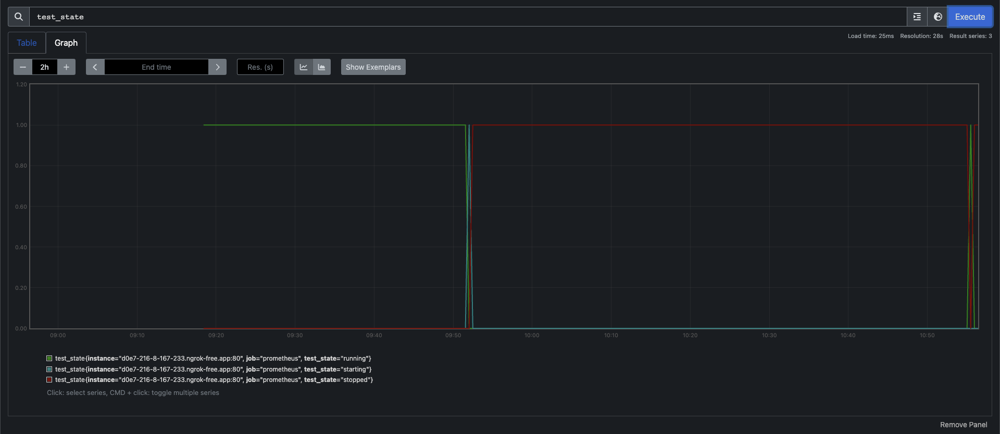

# Prometheus Example

This repository contains a working example of how to use Prometheus to monitor
the state of various metrics within a running project. To run this example, it's necessary to first install [Docker](https://www.docker.com/).

With the Docker daemon running, simply type

    docker compose up --build -d

to start both the Prometheus and (test) App services. To stop them, run

    docker compose down

## How it works

Within the test app, there are two test metrics that are being updated each time a POST request is sent to the `/test` route:

1. `test_counter`: increments by one with each request
2. `test_state`: changes to one of three states randomly, either `["starting", "running", "stopped"]`

To mount the `/metrics` route (used by Prometheus to access the state of these metrics), we need only include the following in our `FastAPI` app:

    metrics_app = make_asgi_app()
    app.mount("/metrics", metrics_app)

Once the app is running, accessing the `/metrics` route gives the following output:

    # HELP test_counter_total A test counter
    # TYPE test_counter_total counter
    test_counter_total 0.0
    # HELP test_counter_created A test counter
    # TYPE test_counter_created gauge
    test_counter_created 1.6832062844408367e+09
    # HELP test_state A test state
    # TYPE test_state gauge
    test_state{test_state="starting"} 0.0
    test_state{test_state="running"} 1.0
    test_state{test_state="stopped"} 0.0

This output is then consumed by Prometheus and monitored periodically (every 15 seconds) as both services run.s

Going to `http://localhost:9090` (the Prometheus services) redirects to an interface which can be used to see how the state of these metrics have varies over time, as the application runs. See the following screenshots, as an example: 

Other types of metrics can be tracked via Prometheus; these are only meant to show a proof-of-concept. These are documented in more detail in the [Prometheus Documentation](https://prometheus.io/docs/concepts/metric_types/).